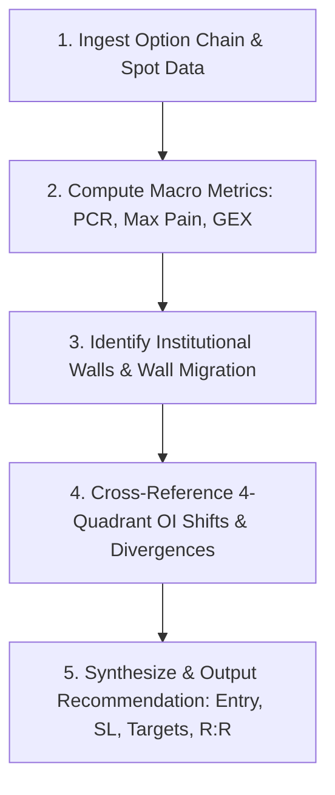

# Institutional Option Chain Analysis Framework (Smart Money Positioning)

This skill provides an institutional-grade, data-driven methodology to decode the **Option Chain**, **Open Interest (OI)**, **Volume Flow**, and **Divergences** for both Indices (`NIFTY50`, `BANKNIFTY`, `SENSEX`) and liquid `F&O Stocks`.

It enables agents and traders to analyze live ("online") and historical/EOD ("offline") option chains to generate actionable **Intraday** and **Swing** trade recommendations with defined risk-to-reward parameters.

---

## 🏛️ Core Market Microstructure: Who is "Big Money"?

In derivatives markets, **institutions (Prop Desks, FIIs, DIIs, Market Makers)** account for $>85\%$ of option writing (selling), while retail traders are predominantly net option buyers.

* **Capital Requirement:** Writing an option requires margin (₹1.2L–₹1.8L per lot in India), whereas buying requires only the premium (₹5,000–₹15,000).
* **Smart Money Rule:** Option writers possess superior capital, latency, risk modeling, and delta-hedging infrastructure. Therefore:
  * **Heavy Call OI at Strike $K$** = Institutional Resistance / Ceiling (Writers bet price stays below $K$).
  * **Heavy Put OI at Strike $K$** = Institutional Support / Floor (Writers bet price stays above $K$).
  * **Trapped Writers:** When price decisively slices through a heavy OI strike, trapped writers are forced to cover (buy back), triggering explosive **Short Squeezes** or **Long Liquidations**.

---

## 🔬 Dimension 1: Volume Analysis & Flow Forensics

Volume represents the transaction intensity of the current session. Analyzing volume in isolation is insufficient; it must be correlated with Open Interest and Strike Distance.

### 1. Volume-to-Open Interest Ratio ($V / OI$)
* **$V / OI > 3.0$ (Speculative Churn):** Heavy day-trading and speculative scalping. Positions are not being carried overnight; low conviction.
* **$V / OI < 0.8$ with Rising OI (Sticky Institutional Accumulation):** Positions are being held and absorbed into overnight books. High institutional conviction.
* **$V / OI$ Surge at Out-of-the-Money (OTM) Strikes ($> 2$ strikes away):**
  * Institutional tail-risk hedging or speculative front-running ahead of an imminent catalyst.

### 2. At-The-Money (ATM) Volume Delta & Taker Aggression
To determine whether buyers or sellers are driving the auction, calculate the **ATM Volume Delta** across ATM and adjacent strikes ($ATM-1, ATM, ATM+1$):
$$\text{ATM Volume Delta} = \sum (\text{Call Volume}) - \sum (\text{Put Volume})$$
$$\text{ATM Volume Ratio} = \frac{\sum \text{Call Volume}}{\max(1, \sum \text{Put Volume})}$$

* **$\text{ATM Volume Ratio} \ge 1.50$:** Aggressive Bullish Volume Intensity (Call takers buying at Ask).
* **$\text{ATM Volume Ratio} \le 0.65$:** Aggressive Bearish Volume Intensity (Put takers buying at Ask).
* **$0.65 < \text{Ratio} < 1.50$:** Neutral / Balanced auction.

### 3. Volume Dry-Up (Contraction before Expansion)
* When option premium volume contracts into a narrow cluster while price coils against an established level, institutional option writers are capping volatility.
* A subsequent volume spike of $\ge 2.0\times$ 5-period average volume confirms an institutional breakout or breakdown.

---

## 📈 Dimension 2: Open Interest (OI) Dynamics & Four-Quadrant Matrix

Open Interest represents the total number of unsettled contracts. Tracking the joint direction of **Price Change ($\Delta P$)** and **OI Change ($\Delta \text{OI}$)** reveals institutional intent:

### 1. The Four Institutional Quadrants

| Price ($\Delta P$) | Open Interest ($\Delta \text{OI}$) | Quadrant Name | Institutional Interpretation | Actionable Bias |
| :---: | :---: | :---: | :--- | :--- |
| **▲ UP** | **▲ UP** | **Long Build-up** | Fresh institutional capital accumulating long positions. Sustainable uptrend. | **BULLISH** (Buy Dips) |
| **▼ DOWN** | **▲ UP** | **Short Build-up** | Fresh institutional capital aggressively shorting. Strong overhead supply. | **BEARISH** (Sell Rallies) |
| **▲ UP** | **▼ DOWN** | **Short Covering** | Trapped short sellers panic-buying to close positions. Violent but often short-lived rally. | **BULLISH MOMENTUM** (Ride & Trail Tight) |
| **▼ DOWN** | **▼ DOWN** | **Long Unwinding** | Longs taking profit or cutting losses. Lack of buying support. | **CAUTIOUSLY BEARISH** (Avoid Catching Knives) |

### 2. Cumulative OI vs Strike-Level Change in OI ($\Delta \text{OI}$)
* **Total OI** reflects the historical battlefield and long-term positioning.
* **Intraday $\Delta \text{OI}$** reveals **today's battle direction**.
* **Rate of Change of OI ($\frac{d\text{OI}}{dt}$):**
  * A sudden influx of $\ge 500,000$ shares in $\Delta \text{OI}$ within a 15-minute window on Nifty (or $\ge 20\%$ of daily average OI in a stock) indicates institutional block allocation.

---

## 🧬 Dimension 3: Option Chain Structure & Institutional Position Architecture

### 1. Put-Call Ratio (PCR) Forensics
$$\text{PCR}_{\text{OI}} = \frac{\text{Total Put Open Interest}}{\text{Total Call Open Interest}}, \quad \text{PCR}_{\text{Vol}} = \frac{\text{Total Put Volume}}{\text{Total Call Volume}}$$

#### Calibrated Thresholds for Market Regimes:

| Asset Class | Extreme Oversold (Short Squeeze Candidate) | Oversold | Neutral Zone | Overbought | Extreme Overbought (Reversal Risk) |
| :--- | :---: | :---: | :---: | :---: | :---: |
| **Indices** (`NIFTY`, `BANKNIFTY`) | $\le 0.55$ | $0.55 - 0.70$ | $0.70 - 1.25$ | $1.25 - 1.40$ | $\ge 1.40$ |
| **F&O Stocks** (Individual Equities) | $\le 0.45$ | $0.45 - 0.55$ | $0.55 - 0.85$ | $0.85 - 1.00$ | $\ge 1.00$ |

* **Volume PCR Leading Indicator:** $\text{PCR}_{\text{Vol}}$ frequently turns **15 to 30 minutes before** $\text{PCR}_{\text{OI}}$ shifts, providing early warning of institutional reversals.

### 2. Max Pain Theory & Expiry Gravitation
* **Max Pain Strike:** The strike price at which total option buyer losses are maximized (and option writers reap maximum profit):
  $$\text{Loss}(K) = \sum_{S_i < K} (K - S_i) \times \text{CallOI}(S_i) + \sum_{S_j > K} (S_j - K) \times \text{PutOI}(S_j)$$
* **Expiry Week Gravitation:** On Thursday/expiry sessions, price exhibits a strong magnetic tendency to pin towards the Max Pain strike as market makers hedge deltas to settle options worthless.
* **Elastic Band Effect:** When Spot deviates $> 1.5\%$ from Max Pain early in the expiry cycle, it creates a powerful mean-reverting elastic pull.

### 3. Institutional Resistance & Support Walls
* **Primary Resistance Wall (CE Wall):** Strike with $\max(\text{Call OI})$.
* **Primary Support Wall (PE Wall):** Strike with $\max(\text{Put OI})$.
* **Wall Migration Tracking:**
  * **CE Wall Moving Down:** Institutional writers lowering their ceiling (aggressive bearish expansion).
  * **PE Wall Moving Up:** Institutional writers raising their floor (bullish stair-stepping).
  * **Narrowing Walls (Straddle Squeeze):** CE and PE walls compressing within 1-2 strikes of ATM $\implies$ Impending explosive volatility breakout.

### 4. Gamma Exposure (GEX) & Market Maker Hedging
* **Positive Gamma Regime ($+\text{GEX}$):**
  * Market makers are long gamma. To remain delta-neutral, they **sell when price rises** and **buy when price falls**.
  * **Market Character:** Dampened volatility, mean-reversion, range-bound behavior. High win rate for fade/scalp strategies.
* **Negative Gamma Regime ($-\text{GEX}$):**
  * Market makers are short gamma. They must **buy when price rises** and **sell when price falls** (accelerating the trend).
  * **Market Character:** High volatility, rapid trend continuation, cascading breakdowns or explosive squeezes.
* **Gamma Flip Point:** The zero-gamma strike dividing stability from directional velocity.

---

## ⚡ Dimension 4: Divergence Analysis (The Edge)

Divergences between Price Action and Option Chain metrics reveal institutional traps and impending trend shifts before they become evident on technical charts.

### 1. Divergence Type A: Price vs PCR Divergence
* **Bullish Reversal Divergence:**
  * **Price Action:** Spot is grinding lower, making lower lows.
  * **Option Flow:** $\text{PCR}_{\text{OI}}$ is rising (making higher lows or increasing from $<0.60 \to 0.80$).
  * **Meaning:** Institutional writers are aggressively selling puts into retail panic. Accumulation under the surface.
* **Bearish Reversal Divergence:**
  * **Price Action:** Spot is pushing higher, making higher highs.
  * **Option Flow:** $\text{PCR}_{\text{OI}}$ is falling (making lower highs or dropping from $>1.30 \to 1.00$).
  * **Meaning:** Institutional writers are aggressively loading call resistance into the rally. Distribution into strength.

### 2. Divergence Type B: The Breakout Trap Detector (Price vs $\Delta \text{OI}$)
* **The Fake Breakout (Bull Trap):**
  * Price breaks out above a major resistance level.
  * **Option Chain Check:** Instead of Call OI unwinding at that strike, **Call OI spikes higher** ($\Delta \text{Call OI} > 0$) and Put writing fails to expand.
  * **Diagnosis:** Institutions are selling calls into the breakout liquidity. The breakout will violently fail and reverse down.
* **The Fake Breakdown (Bear Trap):**
  * Price slices below a key support level.
  * **Option Chain Check:** Instead of Put OI unwinding, **Put OI increases** ($\Delta \text{Put OI} > 0$) and Call writing does not shift lower.
  * **Diagnosis:** Institutions are absorbing buy-side risk. Price will snap back upward into a violent short squeeze.

### 3. Divergence Type C: Volume Delta Exhaustion Divergence
* Price makes a higher intraday high, but **ATM Volume Delta** is negative or forming lower highs.
* **Diagnosis:** The rally is driven by thin liquidity and lack of aggressive buyers. Impending intraday exhaustion top.

---

## 🎯 Dimension 5: Execution Playbook — Intraday & Swing Setups

### Strategy 1: The Institutional Short Squeeze (Intraday Long)
* **Pre-conditions:**
  1. Stock/Index is in **Oversold Territory** ($\text{PCR} \le 0.55$ for indices, $\le 0.45$ for stocks).
  2. Heavy Call OI clustered at Strike $K$ (within $0.5\%$ of spot).
* **Trigger:**
  1. Spot price closes a 5m/15m candle above Strike $K$.
  2. Call OI at Strike $K$ shows significant negative change ($\Delta \text{Call OI} < 0$, unwinding).
  3. ATM Volume Delta turns positive ($> 1.30$).
* **Execution:**
  * **Option Contract:** Buy ATM Call or 1-Strike In-The-Money (ITM) Call.
  * **Stop Loss:** Spot close below Strike $K - 0.3\%$.
  * **Target:** Next major Call Wall or $+1.2\%$ move in spot ($R:R \ge 1:2.5$).

### Strategy 2: The Long Liquidation Flush (Intraday Short)
* **Pre-conditions:**
  1. Stock/Index is in **Overbought Territory** ($\text{PCR} \ge 1.30$ for indices, $\ge 0.85$ for stocks).
  2. Heavy Put OI clustered at Support Strike $S$.
* **Trigger:**
  1. Spot closes below Support Strike $S$ on 5m/15m chart.
  2. Put OI at Strike $S$ starts unwinding ($\Delta \text{Put OI} < 0$).
  3. ATM Volume Delta turns negative ($< 0.70$).
* **Execution:**
  * **Option Contract:** Buy ATM Put or 1-Strike ITM Put.
  * **Stop Loss:** Spot close back above Strike $S + 0.3\%$.
  * **Target:** Next major Put Wall or $-1.2\%$ move in spot.

### Strategy 3: Multi-Touch S/R + PCR Extreme Swing Trade (Multi-Day)
* **Pre-conditions:**
  1. Daily chart exhibits Multi-Touch Support Floor ($\ge 3$ tests, KEI pattern) or Resistance Ceiling.
  2. Option Chain PCR aligns with the contrarian turning point:
     * Support Floor + $\text{PCR} \le 0.50$ (Oversold squeeze).
     * Breakdown Floor + $\text{PCR} \ge 0.85$ (Heavy put writing trapped $\to$ cascading collapse).
  3. Wall Migration confirms direction.
* **Execution:**
  * **Structure:** Buy Monthly Futures or Long Option Spread (Bull Call Spread / Bear Put Spread) to mitigate theta decay.
  * **Holding Period:** 3 to 10 trading sessions.
  * **Target:** $3\times$ Daily ATR.

---

## 📋 Standard Operating Procedure (SOP) for Agents

When requested to analyze an Option Chain (online or offline), execute this 5-step protocol:



### Output Format Template for Trade Recommendations:
```markdown
### 🎯 Institutional Option Chain Forensic: [SYMBOL]
* **Spot LTP:** ₹[Price] | **Timestamp:** [Time]
* **PCR (OI):** [Value] ([Regime: Overbought/Oversold/Neutral]) | **PCR (Vol):** [Value]
* **Max Pain Strike:** ₹[Strike] (Distance: [X]%)
* **Institutional Walls:** Resistance CE Wall: ₹[Strike] ([OI] contracts) | Support PE Wall: ₹[Strike] ([OI] contracts)
* **ATM Volume Delta:** [Delta Ratio]x ([Aggressive Bullish / Bearish / Neutral])
* **Divergence Detected:** [None / Bullish PCR Divergence / Bear Trap / Squeeze]

#### 🚀 Actionable Trade Setup:
* **Strategy:** [Intraday Scalp / Intraday Trend / Swing Trade]
* **Direction:** [BUY CALL / BUY PUT / BULL CALL SPREAD / BEAR PUT SPREAD]
* **Contract/Strike:** [Strike & Expiry]
* **Entry Zone:** ₹[Entry]
* **Stop Loss (Spot Invalidation):** ₹[SL]
* **Target 1 / Target 2:** ₹[T1] / ₹[T2]
* **Risk-to-Reward:** [X]:1
* **Institutional Rationale:** [2-3 sentence summary of smart money positioning]
```
